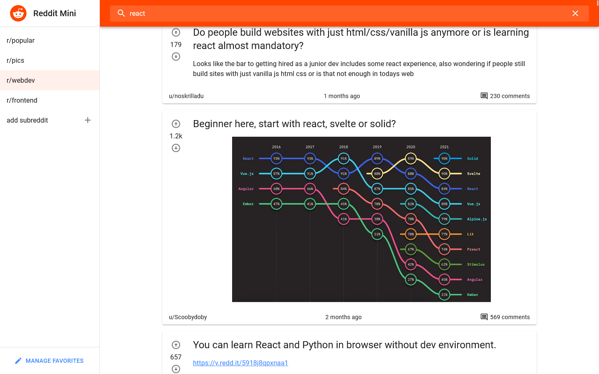

# Reddit Mini 

Minimal Reddit client where users can browse, search and view posts from their favorite subreddits.
 
The data are fetched from the Reddit JSON API. 

[Live Demo](https://abedfetrat.github.io/reddit-mini/)

## My process

I started by getting familiar with the Reddit API. I made research by reading upon the documentation and analyzing the returned JSON data.  
After I had an understanding of how the data is structured and how to consume the API, I started to code the data fetching logic inorder to fetch the data the app needed.  
Now that I had the data, I started with building the UI with help of Material UI components to quickly build a functional UI.  
Once I had a fully functional app I replaced the apps statemanagment with Redux.  

## Built with

- 
- 
- 

## What I learned

With this project I learned to use the Redux library with Redux Toolkit for managing and persisting the app state in a store. 

## Further development

- Authenticate the user with Reddit inorder to be able to vote and comment on posts. 
- Authenticate the user inorder to be able to view all of the comments of a post. 
- Optimize rendering the list of post when there are many posts loaded in the DOM. Use something like React Window.  

## Author

- Frontend Mentor - [@abedfetrat](https://www.frontendmentor.io/profile/abedfetrat)
- Twitter - [@abedfetrat](https://www.twitter.com/abedfetrat)
- LinkedIn - [@abedfetrat](https://www.linkedin.com/in/abedfetrat)